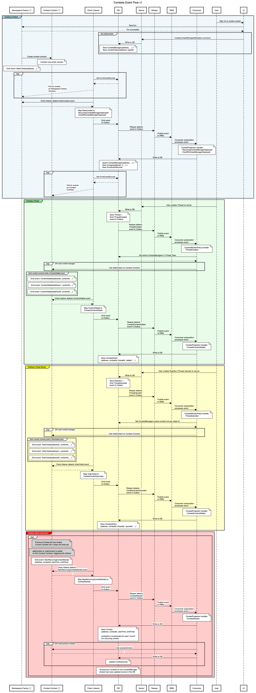

# Contests

Contests is a new feature, based on contest contracts, available for communities on Common. This document outlines the implementation of Contests on our platform.

A contest contract is an on-chain, one-shot or iterated game which receives content submissions and votes on submitted content. It then determines the winning content based on relative voting power applied.

Common Contests are an application of contest contracts using Common content. Winners receive a token-denominated prize from a community-designated pool.

## Basic Rules

Each community may have at most one contest running. Contests continue to run even if the prize pool is empty, but no payments will be made to winners in such cases.

Admins cannot alter the content submission and voting processes. They may alter a contest's prize share, but changes will only affect the following cycle, and the current running cycle will continue unaltered. To be change constructor variables, admins must deploy a new contest contract with their new desired variables.

On-chain data submission will be conducted and sponsored by Commonwealth Labs. As of 240509, Common takes a 10% fee from contest distributions.

Contests logic is managed by `Contest.sol`, and financial processes by the `FeeManager.sol` contract.

## Contest Funding and Economics

Contest prizes are primarily funded through the namespace’s Community Stake transaction commissions. These transaction commissions will be collected by the `FeeManager.sol` contract, and CommunityStake fees generated from the community's staking activities will be directed to the contest contract based on the share of the community stake in the `FeeManager.sol` contract. Additionally, direct transfers to the contest contract are also supported.

Contest project will be able to utilize both ETH and ERC20 tokens. As of 240506, there is no additional funding plan for the contest project.

### Contest Pool and Prizes

Common content that receives the most votes will be rewarded with the contest prize.

Prizes will be distributed based on the following variables:

- `winnerShares` (`uint256[]`): The percentage of shares awarded to each respective placement in the contest, e.g. `[50, 30, 20]` designates a 50%, 30%, and 20% payout to first, second, and third place.
- `prizeShare` (`uint256`): The percentage of the prize pool payed out each interval, e.g. `5` designates `5%`.
- `voterShare` (`uint256`): The percentage of the prize pool claimable by voters each week, e.g. `5` designates `5%`.

### Voting Weight Strategies

Initially, custom vote-weight strategies for the community are not available. The default strategy is "1 stake = 1 vote", similar to the current upvote weight used on the platform with [Stake](./Stake.md) enabled. Communities that would like to integrate contests must have community staking.

NB: In the current off-chain topics, all community members start with 1 vote weight even if they do not have any community stake token. For on-chain contests, the amount of voting weight directly equals the amount of the community stake tokens the user owns.

## Sequence Diagram

## Change Log

- 240627: Sequence diagram added by Ryan Bennett (#7699).
- 240506: Authored by Ege Tekiner and Graham Johnson (#7699).
